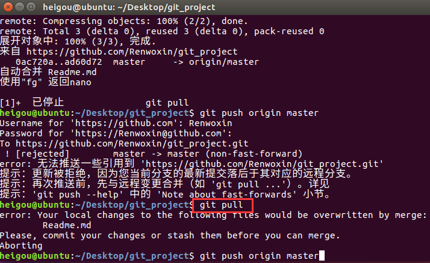
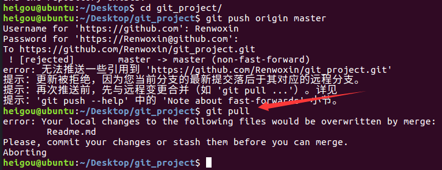
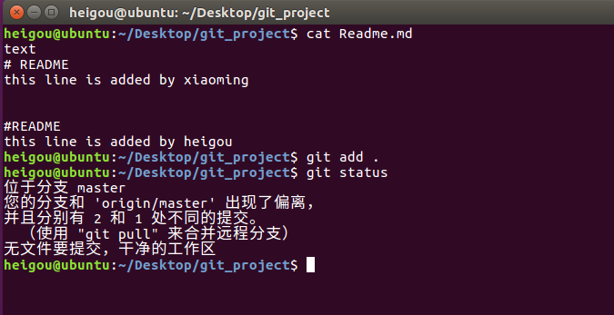
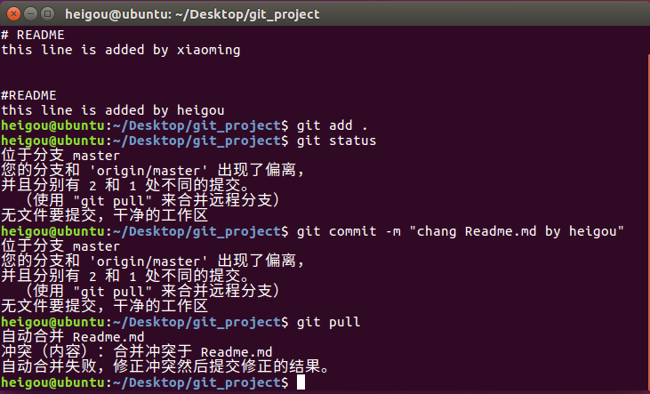
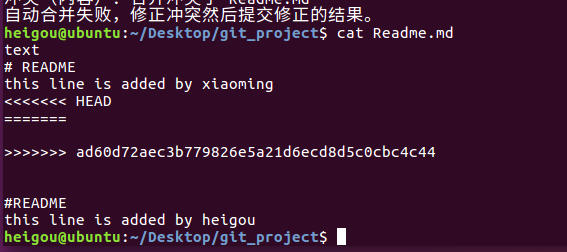
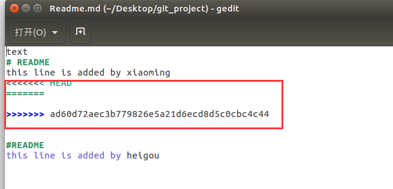
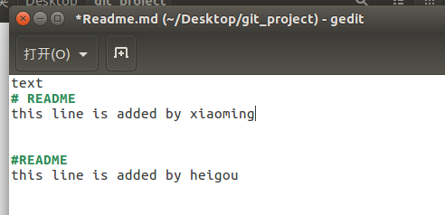
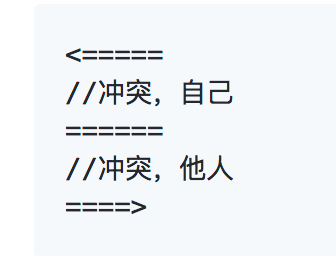

# git 学习与训练

## 情景一：

> 拿到一个份代码，需要将代码使用git进行管理，并且推送到github上。

+ 创建文件夹git_project
```
heigou@ubuntu:~/Desktop/git_exercise$ mkdir git_project
```

+  新建文件Readme.md，aa.py，bb.py
```
heigou@ubuntu:~/Desktop/git_exercise/git_project$ touch Readme.md
heigou@ubuntu:~/Desktop/git_exercise/git_project$ touch aa.py
heigou@ubuntu:~/Desktop/git_exercise/git_project$ touch bb.py
```

+ 使用vim编辑Readme.md添加以下内容

```
text
# README
aa.py
    print("This is aa")

bb.py
    print("This is bb")
```

```
1.heigou@ubuntu:~/Desktop/git_exercise/git_project$ vim Readme.md
2.键入“i”，切换到插入模式
  text
  # README
  aa.py
      print("This is aa")

  bb.py
      print("This is bb")
  ~
  ~                                                                              
3.输入完成后，输入“：”，编辑器下方会出现“：”，在输入“wq”保存并退出

```

+  使用重定向shell语句将
    + print("This is aa")写入aa.py
    + print("This is bb")写入bb.py

```
heigou@ubuntu:~/Desktop/git_exercise/git_project$ echo print\(\"This is aa\"\) > aa.py
heigou@ubuntu:~/Desktop/git_exercise/git_project$ cat aa.py
print("This is aa")

heigou@ubuntu:~/Desktop/git_exercise/git_project$ echo print\(\"This is bb\"\) > bb.py
heigou@ubuntu:~/Desktop/git_exercise/git_project$ cat bb.py
print("This is bb")
```

+ 在github上新建git_project项目，将本地项目在命令行进行上传
```shell
```


## 情景二：
> 模拟多人开发环境，解决提交代码冲突问题
+ 创建新用户xiaomin
``shell
sudo useradd -m xiaoming
``

+ 设置xiaoming用户密码
```shell
sudo passwd xiaoming
```

+ 切换用户
```shell
su xiaoming
```
+ 为小明用户配置git环境（ssh key添加到你的github账号里)
```shell
$ git config --global user.name "xm"
$ git init
```

+ 克隆git_project项目到
```shell
$ git clone https://github.com/Renwoxin/git_project.git
```

+ 修改Readme.md为：
```text
# README
this line is added by xiaoming
```

+ 提交小明的修改到github上，提交信息为"chang Readme.md by xiaoming"
```shell
$ git add .
$ git commit -m "chang Readme.md by xiaoming"
```

+ 切换用户到自己的用户(heigou)
```shell
重启切换
```
+ 修改Readme.md为：
```text
# README
this line is added by heigou
```
+ 提交修改
```shell
$ git add .
$ git commit -m "chang Readme.md by xiaoming"
```

+ 记录报错信息







+ 记录解决
办法
```text
```










heigou@ubuntu:~/Desktop/git_project$ git add .
heigou@ubuntu:~/Desktop/git_project$ git commit -m "chang Readme.md by heigou"
[master 8625636] chang Readme.md by heigou
heigou@ubuntu:~/Desktop/git_project$ git push origin master

+ 寻找避免此类问题发生的方法（合理的使用git进行开发的流程）
```text
在用户xiaoming下add、commit、push之后，如果切换用户add、commit、push，为了避免出错，那么在push之前务必pull
```

## 情景三：

> 合并分支

+ 查看当前分支，保证自己在master分支中

```shell
heigou@ubuntu:~/Desktop/git_project$ git branch
* master
heigou@ubuntu:~/Desktop/git_project$ git log --oneline --graph
* 7989de8 chang git_exercise by heigou
*   8625636 chang Readme.md by heigou
|\  
| * ad60d72 chang Readme.md by xiaoming
* | 8d8e852 chang Readme.md by heigou
* | e391534 chang Readme.md by heigou
|/  
* 0ac720a git_project
```

+ 修改aa.py，添加`print("this line is added by master")`

```shell
heigou@ubuntu:~/Desktop/git_project$ echo print\(\"this line is added by master\"\) >> aa.py
heigou@ubuntu:~/Desktop/git_project$ cat aa.py
print("This is aa")

print("this line is added by master")
```
+ 提交修改到github
```shell
heigou@ubuntu:~/Desktop/git_project$ git add .
heigou@ubuntu:~/Desktop/git_project$ git commit -m "aa.py change2"
[master aef68e7] aa.py change2
 1 file changed, 2 insertions(+), 1 deletion(-)
heigou@ubuntu:~/Desktop/git_project$ git push origin master
```

+ 在heigou用户下创建dev分支（development）分支
```shell
heigou@ubuntu:~/Desktop/git_project$ git branch dev
```

+ 切换用户dev分支

```shell
heigou@ubuntu:~/Desktop/git_project$ git checkout dev
切换到分支 'dev'
heigou@ubuntu:~/Desktop/git_project$ git branch
* dev
  master
heigou@ubuntu:~/Desktop/git_project$ cat aa.py
print("This is aa")

print("this line is added by master")
```

+ 修改aa.py，修改`print("this line is added by heigou")`为`print("this line is changed by heigou")`
```shell
heigou@ubuntu:~/Desktop/git_project$ vim aa.py
```

+ 提交修改到github
```text
heigou@ubuntu:~/Desktop/git_project$ git add .
heigou@ubuntu:~/Desktop/git_project$ git commit -m "master aa.py change2"
```

+ 切换到master分支
```shell
heigou@ubuntu:~/Desktop/git_project$ git checkout master

```

+ 合并dev分支到master分支，记录报错信息
```shell
heigou@ubuntu:~/Desktop/git_project$ git merge dev
更新 aef68e7..c939bc0
Fast-forward
 aa.py | 2 +-
 1 file changed, 1 insertion(+), 1 deletion(-)
```

+ 记录解决方法
```shell
```

+ 合并完在提交github
``shell
``
+ 删除远程和本地分支

```shell
heigou@ubuntu:~/Desktop/git_project$ git branch -d dev
已删除分支 dev（曾为 c939bc0）。
heigou@ubuntu:~/Desktop/git_project$ git push origin --delete dev
Username for 'https://github.com': Renwoxin
Password for 'https://Renwoxin@github.com':
To https://github.com/Renwoxin/git_project.git
 - [deleted]         dev
heigou@ubuntu:~/Desktop/git_project$ git branch -a
* master
  remotes/origin/master
heigou@ubuntu:~/Desktop/git_project$
```

## 情景四
> 一些零碎的技能

ignore`文件，实现文件或文件夹的过滤(
    + 自己举例子，文件和文件夹的例子都要有)
```shell
heigou@ubuntu:~/Desktop/git_project$ vim .gitignore
heigou@ubuntu:~/Desktop/git_project$ mkdir abc
heigou@ubuntu:~/Desktop/git_project$ touch abc.md
heigou@ubuntu:~/Desktop/git_project$ touch aabbcc.md
heigou@ubuntu:~/Desktop/git_project$ vim .gitignore

/abc/
/aabbcc.md

heigou@ubuntu:~/Desktop/git_project$ git add .
heigou@ubuntu:~/Desktop/git_project$ git commit -m "for_ignore"
[master 8604f92] for_ignore
 4 files changed, 2 insertions(+), 3 deletions(-)
 create mode 100644 .gitignore
 create mode 100644 aabbcc.md
heigou@ubuntu:~/Desktop/git_project$ git push origin master
```

+ 放弃本次修改
    + 自己举例子

```shell
heigou@ubuntu:~/Desktop/git_project$ echo print\(\"this is for reback1\"\) >> bb.py
heigou@ubuntu:~/Desktop/git_project$ git add bb.py
heigou@ubuntu:~/Desktop/git_project$ git commit -m "for reback1"
[master bfb9fb4] for reback1
 1 file changed, 2 deletions(-)
heigou@ubuntu:~/Desktop/git_project$ echo print\(\"this is for reback2\"\) >> bb.py
heigou@ubuntu:~/Desktop/git_project$ git add bb.py heigou@ubuntu:~/Desktop/git_project$ git commit -m "for reback2"[master 8ca189d] for reback2
 1 file changed, 1 insertion(+)
heigou@ubuntu:~/Desktop/git_project$ cat bb.py
print("This is bb")
print("this is for reback1")
print("this is for reback2")
heigou@ubuntu:~/Desktop/git_project$ git log --oneline
8ca189d for reback2
bfb9fb4 for reback1
cdb8210 for reback2
c67c24c for reback
8604f92 for_ignore
a9a8da1 update by master
f9b2789 update
30512e9 dev aa.py change1
118512b master aa.py change3
c939bc0 master aa.py change2
aef68e7 aa.py change2
bf339b7 aa.py change1
7989de8 chang git_exercise by heigou
8625636 chang Readme.md by heigou
8d8e852 chang Readme.md by heigou
e391534 chang Readme.md by heigou
ad60d72 chang Readme.md by xiaoming
0ac720a git_project
heigou@ubuntu:~/Desktop/git_project$ git checkout bfb9fb4 -- bb.py
heigou@ubuntu:~/Desktop/git_project$ cat bb.py
print("This is bb")
print("this is for reback1")
heigou@ubuntu:~/Desktop/git_project$

```

+ git diff 的使用（举例子）
    + 参考https://www.cnblogs.com/qianqiannian/p/6010219.html自己举例子

```shell
1.比较工作区与暂存区
heigou@ubuntu:~/Desktop/git_project$ echo print\(\"this is for diff\"\) >> bb.py
heigou@ubuntu:~/Desktop/git_project$ git diff
diff --git a/bb.py b/bb.py
index 91e1042..1559195 100644
--- a/bb.py
+++ b/bb.py
@@ -1,2 +1,3 @@
 print("This is bb")
 print("this is for reback1")
+print("this is for diff")
```
```shell
2.比较暂存区与最新本地版本库（本地库中最近一次commit的内容）
heigou@ubuntu:~/Desktop/git_project$ git add bb.py
heigou@ubuntu:~/Desktop/git_project$ git diff
heigou@ubuntu:~/Desktop/git_project$ git diff --cached
diff --git a/bb.py b/bb.py
index 8a2328f..1559195 100644
--- a/bb.py
+++ b/bb.py
@@ -1,3 +1,3 @@
 print("This is bb")
 print("this is for reback1")
-print("this is for reback2")
+print("this is for diff")
```
```shell
3.比较工作区与最新本地版本库
heigou@ubuntu:~/Desktop/git_project$ git diff HEAD
diff --git a/bb.py b/bb.py
index 8a2328f..1559195 100644
--- a/bb.py
+++ b/bb.py
@@ -1,3 +1,3 @@
 print("This is bb")
 print("this is for reback1")
-print("this is for reback2")
+print("this is for diff")
```
4.比较工作区与指定commit-id的差异
```shell
git diff commit-id  [<path>...]
```

5.比较暂存区与指定commit-id的差异
```shell
git diff --cached [<commit-id>] [<path>...]
```

6.比较两个commit-id之间的差异
```shell
git diff [<commit-id>] [<commit-id>]
```

7.使用git diff打补丁
```
git diff > patch //patch的命名是随意的，不加其他参数时作用是当我们希望将我们本仓库工作区的修改拷贝一份到其他机器上使用，但是修改的文件比较多，拷贝量比较大，
此时可以将修改的代码做成补丁，之后在其他机器上对应目录下使用 git apply patch 将补丁打上即可
git diff --cached > patch //是将我们暂存区与版本库的差异做成补丁
git diff --HEAD > patch //是将工作区与版本库的差异做成补丁
git diff Testfile > patch//将单个文件做成一个单独的补丁
拓展：git apply patch 应用补丁，应用补丁之前我们可以先检验一下补丁能否应用，git apply --check patch 如果没有任何输出，那么表示可以顺利接受这个补丁
另外可以使用git apply --reject patch将能打的补丁先打上，有冲突的会生成.rej文件，此时可以找到这些文件进行手动打补丁　
```

+ 查看远程所有分支（创建多分支，显示多分支）

```shell
heigou@ubuntu:~/Desktop/git_project$ git branch -a
  dev
* master
  remotes/origin/master
heigou@ubuntu:~/Desktop/git_project$ git branch dev1
heigou@ubuntu:~/Desktop/git_project$ git branch dev2
heigou@ubuntu:~/Desktop/git_project$ git branch -a
  dev
  dev1
  dev2
* master
  remotes/origin/master
heigou@ubuntu:~/Desktop/git_project$ git push origin dev1
heigou@ubuntu:~/Desktop/git_project$ git branch -a
  dev
  dev1
  dev2
* master
  remotes/origin/dev1
  remotes/origin/master
heigou@ubuntu:~/Desktop/git_project$ git push origin dev2
heigou@ubuntu:~/Desktop/git_project$ git branch -a
  dev
  dev1
  dev2
* master
  remotes/origin/dev1
  remotes/origin/dev2
  remotes/origin/master
heigou@ubuntu:~/Desktop/git_project$ git branch
  dev
  dev1
  dev2
* master
```
+ 删除分支（举例子）
```shell
1.删除本地分支
heigou@ubuntu:~/Desktop/git_project$ git branch -d dev1
已删除分支 dev1（曾为 8ca189d）。
heigou@ubuntu:~/Desktop/git_project$ git branch -d dev2
已删除分支 dev2（曾为 8ca189d）。
2.删除远程分支
heigou@ubuntu:~/Desktop/git_project$ git push origin --delete dev1
heigou@ubuntu:~/Desktop/git_project$ git push origin --delete dev2
3.删除未合并分支
heigou@ubuntu:~/Desktop/git_project$ git branch -d dev
error: 分支 'dev' 没有完全合并。
如果您确认要删除它，执行 'git branch -D dev'。
heigou@ubuntu:~/Desktop/git_project$ git branch -D dev
已删除分支 dev（曾为 ce70be4）。
```

+ 版本回退（举例子，显示文件的前后变化）
```shell
heigou@ubuntu:~/Desktop/git_project$ cat bb.py
print("This is bb")
print("this is for reback1")
print("this is for diff")
heigou@ubuntu:~/Desktop/git_project$ git log --oneline
8ca189d for reback2
bfb9fb4 for reback1
cdb8210 for reback2
c67c24c for reback
8604f92 for_ignore
a9a8da1 update by master
f9b2789 update
30512e9 dev aa.py change1
118512b master aa.py change3
c939bc0 master aa.py change2
aef68e7 aa.py change2
bf339b7 aa.py change1
7989de8 chang git_exercise by heigou
8625636 chang Readme.md by heigou
8d8e852 chang Readme.md by heigou
e391534 chang Readme.md by heigou
ad60d72 chang Readme.md by xiaoming
0ac720a git_project
heigou@ubuntu:~/Desktop/git_project$ git checkout cdb8210 -- bb.py
heigou@ubuntu:~/Desktop/git_project$ cat bb.py
print("This is bb")
print("this is for reback1")
print("this is for reback1")
print("this is for reback2")
```

+ 移除文件git rm的使用（举例子）
```shell
heigou@ubuntu:~/Desktop/git_project$ touch aa
heigou@ubuntu:~/Desktop/git_project$ mkdir cc
heigou@ubuntu:~/Desktop/git_project$ la
aa         aa.py  abc.md  cc    git_exercise.md  image       Readme.md
aabbcc.md  abc    bb.py   .git  .gitignore       Readme1.md
heigou@ubuntu:~/Desktop/git_project$ rm aa
heigou@ubuntu:~/Desktop/git_project$ rm -r cc
heigou@ubuntu:~/Desktop/git_project$ la
aabbcc.md  abc     bb.py  git_exercise.md  image       Readme.md
aa.py      abc.md  .git   .gitignore       Readme1.md
```

+ 远程仓库的移除与重命名（举例子）
```shell
暂时没找到
```

https://git-scm.com/book/zh/v1/Git-%E5%9F%BA%E7%A1%80-%E8%BF%9C%E7%A8%8B%E4%BB%93%E5%BA%93%E7%9A%84%E4%BD%BF%E7%94%A8
在新版 Git 中可以用 git remote rename 命令修改某个远程仓库在本地的简称，比如想把 pb 改成 paul，可以这么运行：

$ git remote rename pb paul
$ git remote
origin
paul
注意，对远程仓库的重命名，也会使对应的分支名称发生变化，原来的 pb/master 分支现在成了 paul/master。

碰到远端仓库服务器迁移，或者原来的克隆镜像不再使用，又或者某个参与者不再贡献代码，那么需要移除对应的远端仓库，可以运行 git remote rm 命令：

$ git remote rm paul
$ git remote
origin
